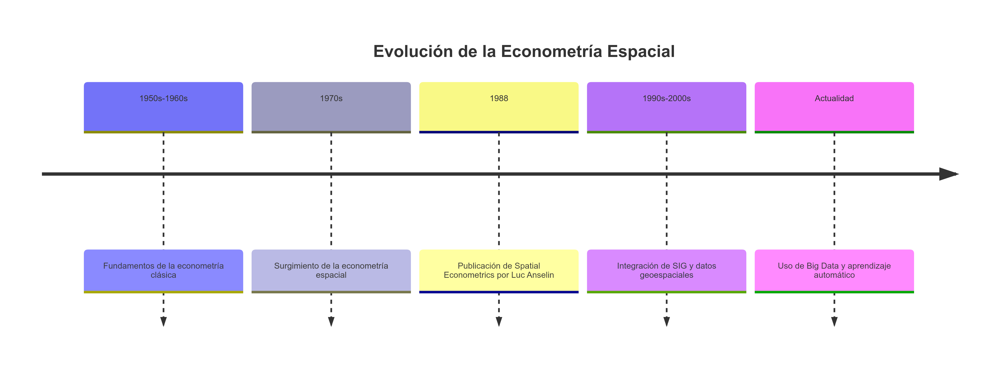

class: title-slide center middle
background-image: url(`r params$background_img`)
background-size: 110%

## `r rmarkdown::metadata$title`
### `r rmarkdown::metadata$subtitle`


---
background-image: url(img/slide_nb.png)
background-position: top left
background-size: 140%
padding-top: 150px
class: top left


### Ciencia Abierta y Reproducible con R

  - **R y el Código Abierto**:
    - R, desarrollado en 1993 por Ross Ihaka y Robert Gentleman, es un lenguaje de programación de código abierto enfocado en el análisis estadístico.
    - Promueve la transparencia y colaboración, permitiendo a los investigadores compartir y reproducir análisis fácilmente.
  - **Importancia de la Reproducibilidad**:
    - La reproducibilidad es esencial para validar resultados y avanzar en el conocimiento científico.
    - R facilita la documentación y distribución de código, fortaleciendo la integridad científica.

.pull-left[
 > <image width="280px" src="https://thermanuals.wordpress.com/wp-content/uploads/2014/12/rr.jpg">
    
]   

.pull-right[
> Ihaka, R., & Gentleman, R. (1996). *R: A Language for Data Analysis and Graphics*. **Journal of Computational and Graphical Statistics**, 5(3), 299-314.
]


---
background-image: url(img/slide_nb.png)
background-position: top left
background-size: 140%
padding-top: 150px
class: top left

### Incorporando el Espacio en el Modelamiento Estadístico

<div class="container" style="position: relative; overflow: visible;">
  
</div>

---
background-image: url(img/slide_nb.png)
background-position: top left
background-size: 140%
padding-top: 150px
class: top left

### Incorporando el Espacio en el Modelamiento Estadístico


.pull-left[

]


.pull-right[

Áreas de Aplicación Importantes
- **Planificación Urbana**: Análisis de distribución de recursos y servicios.
- **Economía Regional**: Estudio de interdependencias entre regiones y distribución de shicks.
- **Salud Pública**: Mapeo de enfermedades y recursos sanitarios.
- **Agricultura y medio ambiente**: Análisis de uso de tierra, efectos del cambio climático, impacto sobre la flora y fauna.
]


---
background-image: url(img/slide_nb.png)
background-position: top left
background-size: 140%
padding-top: 150px
class: top left

#  Fuentes bibliográficas

.pull-left[
Anselin, L. (1988). *Spatial Econometrics: Methods and Models*. **Kluwer Academic Publishers**.


]

.pull-right[
LeSage, J., & Pace, R. K. (2009). *Introduction to Spatial Econometrics*. **CRC Press**.


]

---
background-image: url(img/slide_nb.png)
background-position: top left
background-size: 140%
padding-top: 150px
class: top left

###  Fuentes bibliográficas

.pull-left[
Moraga, P. (2023). *Spatial Statistics for Data Science: Theory and Practice with R*. CRC Press. ISBN: 9781032204334.


]

.pull-right[

Kopczewska, K. (2020). *Applied Spatial Statistics and Econometric Data Analysis*. Routledge. ISBN: 9780367422499.


]

---
background-image: url(img/slide_nb.png)
background-position: top left
background-size: 140%
padding-top: 150px
class: top left


## Buscar ayuda en R 🤔  

.pull-left[


- **Abrir una ventana de ayuda**:
```r
  help.start()
```


- **Buscar información acerca de un tema específico**:
```r
  help.search("...")
```


- **Buscar ayuda sobre una función**:
```r
  help(...)
  ?...
```

]

.pull-right[


- **Buscar viñetas disponibles**:
```r
  vignette()
```


- **Buscar una viñeta específica**:
```r
  vignette("...")
```

### Web:

- [Stackoverflow](https://stackoverflow.com)
- [Rpubs](https://rpubs.com)
- [Mailing List](https://stat.ethz.ch/mailman/listinfo/r-help)
- [Github](https://github.com)

]
---
background-image: url(img/slide_nb.png)
background-position: top left
background-size: 140%
padding-top: 170px
class: top left


  ### Tecnologia y el análisis espacial
  
- Sistemas satelitales como Copernicus y los Sentinel nutren el análisis espacial con datos abundantes y de alta resolución.  
- IA aplicada a geodatos (desde modelos de OpenAI hasta GPUs de NVIDIA) agiliza descubrimientos antes impensables.  
- Herramientas reproducibles dejan de ser “opción” para ser estándar, garantizando resultados confiables y auditables.  

.center[


]


---
background-image: url(img/slide_nb.png)
background-position: top left
background-size: 140%
padding-top: 170px
class: middle 


.pull-left[


]

.pull-right[
  - **Ecosistema Tidyverse y RStudio**:
    - **Tidyverse**: Colección de paquetes de R para ciencia de datos que promueven una sintaxis coherente y funcional.
    - **RStudio**: Entorno de desarrollo integrado que facilita la programación en R y la gestión de proyectos reproducibles.
    - **Beneficios**:
      - Simplificación de tareas complejas en manipulación y visualización de datos.
      - Fomento de buenas prácticas y estandarización en el análisis.
  - **Recursos Comunitarios**:
    - [Página oficial de Tidyverse](https://www.tidyverse.org/)
    - [RStudio](https://posit.co/downloads/)
]
> Integrarse y contribuir a la comunidad de R fortalece nuestras habilidades y la calidad de nuestro trabajo analítico.


---
background-image: url(img/slide_nb.png)
background-position: top left
background-size: 140%
padding-top: 150px
class: top left

## Conceptos claves del analisis estadístico de datos

El análisis de datos debe seguir siempre el **principio de reproducibilidad**


- Los datos vienen en una variedad de formatos y estructuras.
- El proceso de comprensión y limpieza de los datos es un ciclo que poco a poco va mejorando la calidad de los resultados.
- Nuestro objetivo final es la información, que se obtiene a través de la visualización y el modelamiento de los datos.

---
background-image: url(img/slide_nb.png)
background-position: top left
background-size: 140%
padding-top: 150px
class: top left

## Flujo del analisis espacial

El análisis de espacialimplica la implementación de  **herramientas y métodos de corte espacial (GIS):**

- Para el análisis de datos espaciales, es necesario considerar la ubicación geográfica de los datos y su representación en los datos. 
- Los modelos espaciales pueden ser utilizados para analizar la dependencia espacial y la heterogeneidad espacial en los datos. 
- En el análisis espacial se parte del supuesto de que la presencia de los "vecinos" tiene incidencia en el comportamiento de las variables observados para un individuo o unidad de análisis.

.center[
**En el análisis espacial algunas de las suposiciones del modelo de regresión lineal clásico, como la independencia de las observaciones, se ven violadas.**

Es por ello que debemos definir un flujo de análisis, evaluación, crítica y mejora de los modelos econométricos espaciales. 

]
---
background-image: url(img/slide_nb.png)
background-position: top left
background-size: 140%
padding-top: 150px
class: top left


---

background-image: url(img/slide_nb.png)
background-position: top left
background-size: 140%
padding-top: 150px
class: top left

## Conceptos claves del analisis espacial

.center[


]

- **Puntos:** Lugares, coordenadas geográficas, sin area ni longitud
- **Lineas:** Carreteras, rios, fronteras
- **Poligonos:** Terrenos, regiones, paises


---


background-image: url(img/slide_nb.png)
background-position: top left
background-size: 140%
padding-top: 150px
class: top left


## Niveles de la Modelización Econométrica Espacial

La modelización econométrica espacial es compleja y debe ser abordada desde múltiples niveles:
.pull-left[

.center[

]

]

.pull-right[
- **Teoría de la Estimación:** Implica la consideración de clases de estimadores y sus propiedades.
- **Construcción de Modelos Teóricos:** Basados en la teoría económica, se seleccionan variables y se determina la forma del modelo.

]
- **Técnicas de Estimación:** Incluye la evaluación del ajuste, la calidad del modelo y la selección del mejor modelo.
- **Interpretación de Modelos:** Analiza tanto el tamaño y la significancia de los coeficientes obtenidos como la traducción de los resultados en fenómenos y mecanismos discutidos en la teoría.

---
background-image: url(img/slide_nb.png)
background-position: top left
background-size: 140%
padding-top: 150px
class: top left

## Consideraciones en la Modelización

Al iniciar la modelización espacial econométrica, en la que necesariamente se dan **variables dependientes y exógenas**, hay que tener en cuenta las **fuentes de dependencia espacial y de heterogeneidad espacial**.

.pull-left[

.center[<p style = "font-size: x-large"> </p>
### Dinamicas y flujos espaciales
]


- Como el comercio o la transferencia de conocimientos.
- Conexiones entre regiones que inducen dependencia espacial.

]

.pull-right[

.center[<p style = "font-size: x-large"> </p>
### Variables Omitidas
]

  

- Factores no observados, como servicios o agrupaciones.
- Pueden generar correlación espacial no modelada.

]

---
background-image: url(img/slide_nb.png)
background-position: top left
background-size: 140%
padding-top: 150px
class: top left

## Consideraciones en la Modelización

Al iniciar la modelización espacial econométrica, en la que necesariamente se dan **variables dependientes y exógenas**, hay que tener en cuenta las **fuentes de dependencia espacial y de heterogeneidad espacial**.

.pull-left[

.center[<p style = "font-size: x-large"> </p>
###  Errores de Medición
]

- Resultado de límites administrativos que no corresponden a la realidad espacial.
- Pueden inducir heterogeneidad no observada.


]

.pull-right[

.center[<p style = "font-size: x-large"> </p>
### Operaciones Administrativas
]


- Diseños como las encuestas pueden inducir autocorrelación espacial.
- Pueden sesgar los resultados desde el diseño inicial del estudio.


]


---
background-image: url(img/slide_nb.png)
background-position: top left
background-size: 140%
padding-top: 150px
class: top left

### ¿Qué pasa si se omite la dimensión espacial cuando los datos tienen una naturaleza espacial?


.pull-left[
#### Consecuencias respecto al modelo de regresión lineal clásico

- La homocedasticidad se debe garantizar en la regresión lineal, dividiendo la población en grupos adecuados.
- Cuando se omite la dimensión espacial, se rompe la suposición de independencia entre las observaciones.
- Los errores del modelo no mostrarán una covarianza de cero, lo que indica correlación entre errores de lugares cercanos.
]

.pull-right[
#### Otras consecuencias

- Los datos geolocalizados tienen una naturaleza espacial, implicando autocorrelación, heterogeneidad y heterocedasticidad.
- Si se omite una variable espacial significativa, como el retardo espacial, se produce un error de especificación en el modelo.
- Al no considerar el retardo espacial en un modelo econométrico, los estimadores serán sesgados, sobreestimados e inconsistentes.
]


---
background-image: url(img/slide_nb.png)
background-position: top left
background-size: 140%
padding-top: 150px
class: top left

## Métodos para Abordar la Dependencia Espacial

En presencia de dependencia o heterogeneidad espacial, hay varias formas de abordar este problema. 

- 🌐🌐 **Uso de Datos en Diferentes Escalas Espaciales:** Como datos puntuales o agregados o datos por división administrativa o en una cuadrícula. 	
- 0️⃣1️⃣ **Incluir variables que aproximen fenómenos espaciales no observados:** Como variables dummy (cero-uno) o variables que se asemejan a la distribución espacial del error.
- 📚 📚 **Incluir Coordenadas Geográficas:** Como variables explicativas.
- 👫 👫 **Estimación en Grupos Homogéneos:** Modelos en "clubs" que muestran homogeneidad interna.
- 🌞 🌞 **Selección de Métodos de Estimación Espacial Adecuados:** Incluyendo la elección de matrices de pesos espaciales y la especificación del modelo.

> El objetivo final de un modelo de corte espacial es eliminar todo rastro de **autocorrelacion espacial** buscando que el termino de error tenga buenas propiedades. 
---

background-image: url(img/slide_nb.png)
background-position: top left
background-size: 140%
padding-top: 150px
class: top left

## Modelos espaciales


.pull-left[

]

.pull-right[

**Supuestos de OLS**  
- Linealidad en la relación entre las variables explicativas y la dependiente.  
- Esperanza del error igual a cero (no sesgo).  
- Homocedasticidad de los residuos (varianza constante).  
- Ausencia de autocorrelación serial y espacial en los residuos.  
- Independencia entre los errores y las variables explicativas.
]

---

background-image: url(img/slide_nb.png)
background-position: top left
background-size: 140%
padding-top: 150px
class: top left

## Modelos espaciales


---

background-image: url(img/slide_nb.png)
background-position: top left
background-size: 140%
padding-top: 150px
class: top left

## Modelos espaciales


.pull-left[

]

.pull-right[


**Opciones ante la dependencia o heterogeneidad espacial**  
- Ajustar la escala espacial de los datos (agregación, nivel administrativo, grid/raster).  
- Incluir variables que representen fenómenos espaciales no observados (dummies, proxies).  
- Incorporar coordenadas geográficas (modelos de expansión).  
- Estimar modelos en grupos homogéneos (clubs).  
- Seleccionar métodos espaciales adecuados (matriz de pesos, tipo de modelo, especificación óptima).
]


---
background-image: url(img/slide_nb.png)
background-position: top left
background-size: 140%
padding-top: 150px
class: top left

## Matrices de vecindad

Una matriz de vecindad es una matriz cuadrada que representa las relaciones espaciales entre diferentes unidades geográficas. Cada fila y cada columna de la matriz corresponden a una unidad espacial, como un municipio, una parcela de terreno o una celda en una cuadrícula. Los elementos de la matriz indican la relación o la proximidad entre las unidades.

.center[


]


---
background-image: url(img/slide_nb.png)
background-position: top left
background-size: 140%
padding-top: 150px
class: top left

## Matrices de vecindad

### Tipos Comunes de Matrices de Vecindad:

- **Matriz de Distancia:** Utiliza distancias reales entre unidades como elementos de la matriz.
- **Matriz de Contigüidad:** Basada en la contigüidad espacial entre unidades.


---
background-image: url(img/slide_nb.png)
background-position: top left
background-size: 140%
padding-top: 150px
class: top left


## Autocorrelación Espacial

La autocorrelación espacial se utiliza para describir en qué medida una variable está correlacionada consigo misma a través del espacio. La autocorrelación espacial positiva se produce cuando las observaciones con valores similares están más próximas entre sí (es decir, agrupadas). La autocorrelación espacial negativa se produce cuando las observaciones con valores distintos están más próximas entre sí (es decir, dispersas)


