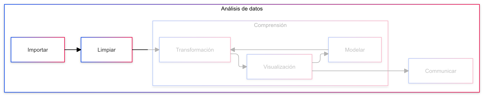
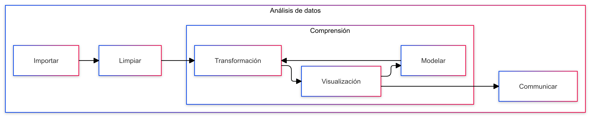
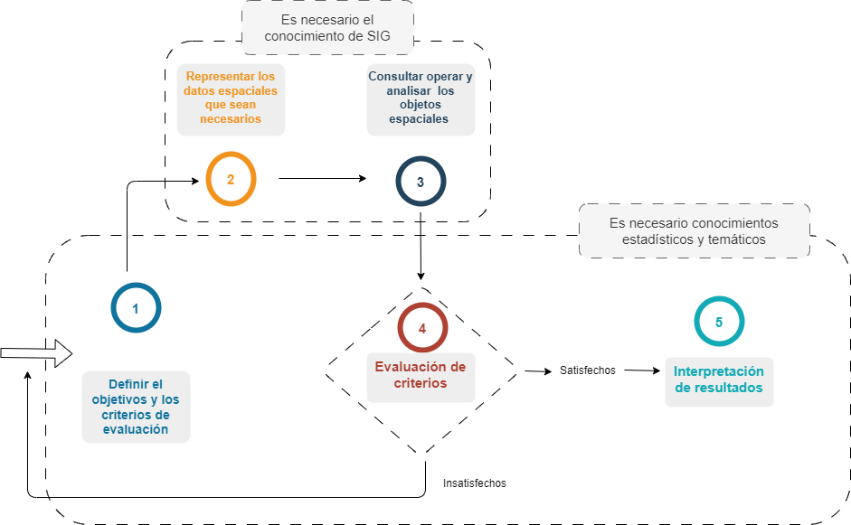
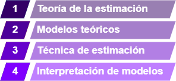
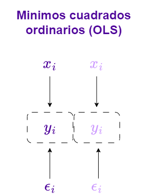
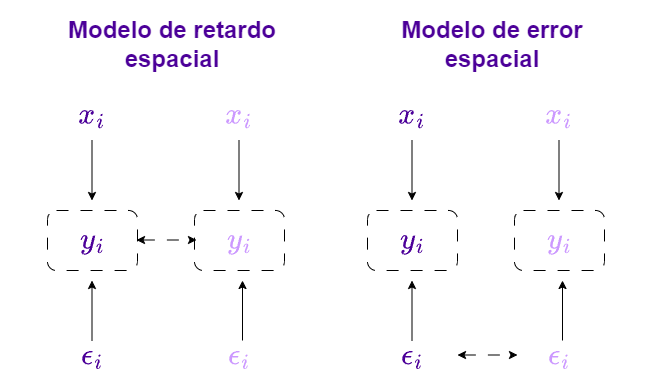
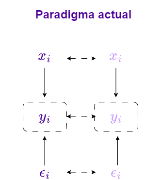

class: title-slide center middle
background-image: url(`r params$background_img`)
background-size: 110%

## `r rmarkdown::metadata$title`
### `r rmarkdown::metadata$subtitle`

```{r, include = FALSE}

knitr::opts_chunk$set(eval = FALSE)

```

---
background-image: url(img/slide_nb.png)
background-position: top left
background-size: 140%
padding-top: 160px
class: top left


### ¿Que vamos a aprender en esta clase?

- En el mundo real vamos a encontrarnos con un sin fin de archivos y formatos de datos. **¿Cómo podemos importarlos a R?**
- Despues de cargar los datos es necesario un proceso de limpieza y transformación **¿Cuales son los problemas más regulares en los datos y como podemos reolverlos con R?**
- Un nadador no se lanza al mar a la primera oportunidad, primero se prepara y se entrena. **¿Cómo podemos explorar nuestros datos antes de modelarlos?**


*"El EDA puede ayudar a responder preguntas sobre desviaciones estándar, variables categóricas e intervalos de confianza. Una vez que el EDA está completo y se obtienen los insights, sus características se pueden usar para un análisis o modelado de datos más sofisticado, incluyendo el machine learning."*

.pull-left[[--IBM](https://www.ibm.com/mx-es/topics/exploratory-data-analysis)]

.pull-right[


]


---
background-image: url(img/slide_nb.png)
background-position: top left
background-size: 140%
padding-top: 150px
class: top left

### Los primeros pasos son los más importantes

<div class="container" style="position: relative; overflow: visible;">
  
</div>

.pull-left[
####**Importación de datos**


]

.pull-right[

####**Limpieza de datos**


]
---
class: inverse, middle

# Lectura o importación de datos

### En este módulo resolveremos las siguientes preguntas:

- ¿Como incorporar datos de distintas fuentes en una sesión de R?
- ¿Qué librerias podemos usar para importar datos?
- ¿Que propiedades tienen los datos que importamos y como podemos explorarlas?

---

background-image: url(img/slide_nb.png)
background-position: top left
background-size: 140%
padding-top: 150px
class: top left

### Variedad de fuentes de datos


Una inmensa variedad de archivos para guardar datos requiere de una diversidad de funciones para importarlos a R.


| **Función**       | **Casos de uso**                                                                                           | **Ejemplo de uso**                                                                                   |
|--------------------|----------------------------------------------------------------------------------------------------------|-----------------------------------------------------------------------------------------------------|
| `read_csv()`      | Para leer archivos delimitados por comas (CSV). Ideal para datos exportados de hojas de cálculo o sistemas. | `data <- read_csv("archivo.csv")`                                                                  |
| `read_csv2()`     | Para leer archivos delimitados por punto y coma (CSV). Común en países donde el separador decimal es `,`.  | `data <- read_csv2("archivo_semicolon.csv")`                                                       |

---

background-image: url(img/slide_nb.png)
background-position: top left
background-size: 140%
padding-top: 150px
class: top left

### Variedad de fuentes de datos

| **Función**       | **Casos de uso**                                                                                           | **Ejemplo de uso**                                                                                   |
|--------------------|----------------------------------------------------------------------------------------------------------|-----------------------------------------------------------------------------------------------------|
| `read_tsv()`      | Para leer archivos delimitados por tabulaciones (TSV). Útil para datos con columnas separadas por `\t`.    | `data <- read_tsv("archivo.tsv")`                                                                  |
| `read_delim()`    | Para leer archivos delimitados por un separador definido por el usuario (puedes especificar el delimitador).| `data <- read_delim("archivo_delim.txt", delim = '\t')`                                             |

> Fijate que en este caso ambos archivos tienen el mismo separador, pero la función `read_delim()` nos permite especificar el separador. En este caso el simbolo de tabulación es `\t`.
---

background-image: url(img/slide_nb.png)
background-position: top left
background-size: 140%
padding-top: 150px
class: top left

### Variedad de fuentes de datos

| **Función**       | **Casos de uso**                                                                                           | **Ejemplo de uso**                                                                                   |
|--------------------|----------------------------------------------------------------------------------------------------------|-----------------------------------------------------------------------------------------------------|
| `read_fwf()`      | Para leer archivos de ancho fijo (Fixed-Width Files). Se utiliza cuando las columnas tienen tamaños fijos. | `data <- read_fwf("archivo_fwf.txt", fwf_widths(c(5, 10, 15)))`                                    |
| `read_table()`    | Para leer archivos de texto con columnas separadas por espacios. Similar a `read.table()` base, pero más eficiente. | `data <- read_table("archivo_table.txt")`                                                          |

> R Base tiene muy buenas funciones para lectura de archivos. Por default las funciones de lectura de datos de R base asumen que el archivo tiene un encabezado y que los datos están separados por comas. Si tu archivo no cumple con estas características, puedes usar las funciones de lectura de datos de `readr` que son más flexibles.
---

background-image: url(img/slide_nb.png)
background-position: top left
background-size: 140%
padding-top: 150px
class: top left

### Variedad de fuentes de datos

| **Función**       | **Casos de uso**                                                                                           | **Ejemplo de uso**                                                                                   |
|--------------------|----------------------------------------------------------------------------------------------------------|-----------------------------------------------------------------------------------------------------|
| `read_file()`     | Para leer el contenido completo de un archivo como una sola cadena de texto (útil para archivos no tabulares).| `content <- read_file("archivo.txt")`                                                              |
| `read_lines()`    | Para leer un archivo línea por línea. Útil para procesar logs o grandes archivos línea por línea.          | `lines <- read_lines("archivo.log")`                                                              |

> En ocasiones el contenido de los archivos no tiene una estructura que se pueda leer como un dataframe. En estos casos es útil leer el contenido completo del archivo como una cadena de texto o leerlo línea por línea.
---

background-image: url(img/slide_nb.png)
background-position: top left
background-size: 140%
padding-top: 150px
class: top left

### Variedad de fuentes de datos

| **Función**       | **Casos de uso**                                                                                           | **Ejemplo de uso**                                                                                   |
|--------------------|----------------------------------------------------------------------------------------------------------|-----------------------------------------------------------------------------------------------------|
| `read_rds()`      | Para leer archivos en formato RDS (archivos guardados con `saveRDS()` en R).                              | `data <- read_rds("archivo.rds")`                                                                  |
| `read_log()`      | Diseñada para leer archivos de log. Permite separar por patrones específicos para análisis.                | `logs <- read_log("archivo.log", delim = " ")`                                                     |

> Los arcvhivos RDS son una forma eficiente de guardar objetos de R. Son binarios y no se pueden leer con un editor de texto. Para leerlos en R se usa la función `read_rds()`.

**Importante:** Las funciones de la libreria `readr`generalmente devuelven un `tibble`, que es una versión moderna y eficiente de un `data.frame`.


---
background-image: url(img/slide_nb.png)
background-position: top left
background-size: 140%
padding-top: 150px
class: top left


### **Argumentos clave en las funciones de `readr`**

**`file`**  
   - Especifica el nombre o ruta del archivo a leer.

**`col_names`**  
   - Define si los nombres de las columnas están en la primera fila del archivo o si se deben proporcionar manualmente.
   - Valores posibles:
     - `TRUE` (por defecto): La primera fila contiene los nombres de las columnas.
     - `FALSE`: Los nombres de las columnas se generan automáticamente como `X1, X2, ...`.
     - Un vector de nombres personalizados: `col_names = c("col1", "col2")`.

```{r}
# Leamos un archivo que tiene 3 columnas, 
# pero la primera fila no contiene los nombres de dichas columnas

read_csv("data.csv", col_names = FALSE)
```

 

---
background-image: url(img/slide_nb.png)
background-position: top left
background-size: 140%
padding-top: 150px
class: top left


### **Argumentos clave en las funciones de `readr`**
**`col_types`**  
   - Especifica manualmente el tipo de datos de cada columna.
   - Valores posibles:
     - `NULL` (por defecto): `readr` adivina el tipo.
     - Una cadena como `"ccc"` para caracteres o `"dil"` para double, integer y logical.
     - Un vector con funciones como `cols(col1 = col_character(), col2 = col_double())`.


```{r}
read_csv("data.csv", col_types = cols(col1 = col_character()))
```

 **`locale`**  
   - Configura aspectos culturales como la codificación, el separador decimal y el idioma de las fechas.
   - **Tipo de dato**: `locale()` (un objeto creado con `locale()`).
   
```{r}
read_csv("data.csv", locale = locale(decimal_mark = ","))`
```
   


---
background-image: url(img/slide_nb.png)
background-position: top left
background-size: 140%
padding-top: 150px
class: top left

### **Argumentos del objeto `locale()`**

El argumento **`locale`** es clave para manejar archivos con configuraciones regionales específicas. Los parámetros más importantes son:

**`decimal_mark`**  
   - Define el símbolo usado como separador decimal.
   - **Valores posibles**: `"."` (por defecto, punto) o `","` (coma).
   - `locale(decimal_mark = ",")`

**`grouping_mark`**  
   - Especifica el separador de miles.
   - **Valores posibles**: `","`, `"."`, o espacio (`" "`).
   - `locale(grouping_mark = " ")`

**`encoding`**  
   - Define la codificación del archivo.
   - **Valores posibles**: `"UTF-8"` (por defecto), `"ISO-8859-1"`, `"Windows-1252"`, etc.
   - `locale(encoding = "ISO-8859-1")`

---
background-image: url(img/slide_nb.png)
background-position: top left
background-size: 140%
padding-top: 150px
class: top left

### **Argumentos del objeto `locale()`**
**`date_names`**  
   - Configura el idioma de los nombres de meses y días.
   - **Valores posibles**: `"en"` (inglés), `"es"` (español), `"fr"` (francés), etc.
   - `locale(date_names = "es")`

**`time_format`**  
   - Define el formato de las fechas y horas.
   - **Valores posibles**: Formatos estándar como `"Y-m-d H:M:S"`.
   - `locale(time_format = "%d/%m/%Y")`

**`tz`**  
   - Configura la zona horaria para las columnas de tipo fecha-hora.
   - **Valores posibles**: `"UTC"`, `"America/Guayaquil"`, etc.
   - `locale(tz = "America/Guayaquil")`

---
background-image: url(img/slide_nb.png)
background-position: top left
background-size: 140%
padding-top: 150px
class: top left

### **Ejemplo práctico con `locale`**

Supongamos que tienes un archivo CSV con los siguientes ajustes regionales cuyo **separador decimal** es la coma, el **separador de miles** es el punto y las **fechas** están en español (ejemplo: 01 de enero de 2023). Puedes leerlo así:

```{r}
library(readr)

# Configuración del locale
mi_locale <- locale(
  decimal_mark = ",",
  grouping_mark = ".",
  date_names = "es",
  encoding = "ISO-8859-1"
)

# Leer el archivo con configuración personalizada
data <- read_csv("archivo.csv", locale = mi_locale)

# Verificar los datos
print(data)
```

Esto asegura que los datos sean interpretados correctamente según las convenciones regionales. 😊

---
background-image: url(img/slide_nb.png)
background-position: top left
background-size: 140%
padding-top: 150px
class: top left

### Lectura de otras fuentes con `haven`

| **Función**         | **Casos de uso**                                                                                  | **Ejemplo de uso**                                                                                      |
|----------------------|--------------------------------------------------------------------------------------------------|--------------------------------------------------------------------------------------------------------|
| `read_sas()`        | Para leer archivos de datos en formato SAS (archivos `.sas7bdat` o `.sas7bcat`).                  | `data <- read_sas("archivo.sas7bdat")`                                                                |
| `read_sav()`        | Para leer archivos en formato SPSS (archivos `.sav`).                                            | `data <- read_sav("archivo.sav")`                                                                     |
| `read_dta()`        | Para leer archivos en formato Stata (archivos `.dta`).                                           | `data <- read_dta("archivo.dta")`                                                                     |
> `haven` es una gran alternativa para leer archivos de otros programas estadísticos. Es muy útil para trabajar con datos de encuestas, estudios de mercado y otros datos de investigación. Al igual que readr el resultado de estas funciones es un `tibble`. Sin embargo, al tener origen en otros programos, las tablas resultantes pueden tener más atributos que pueden resultar útiles para el análisis.


---
background-image: url(img/slide_nb.png)
background-position: top left
background-size: 140%
padding-top: 150px
class: top left

Aquí tienes la sección de manipulación de etiquetas y limpieza reescrita con la sintaxis del tidyverse, usando funciones como `mutate` para realizar las transformaciones:

---
background-image: url(img/slide_nb.png)
background-position: top left
background-size: 140%
padding-top: 150px
class: top left

### `haven` y `tidyverse` en acción

**`labelled()`**
   - Asigna etiquetas a los valores de un vector dentro de un data frame.
    
```{r}
data <- data %>%
  mutate(variable = labelled(variable, 
                           labels = c("Bajo" = 1, 
                                      "Medio" = 2,
                                      "Alto" = 3)))
```

**`as_factor()`**
   - Convierte variables etiquetadas (`labelled`) en factores, manteniendo las etiquetas.
   
```{r}
data <- data %>%
  mutate(variable = as_factor(variable))
```

- En todos los ejemplos, la transformación se realiza en un data frame dentro de un flujo `dplyr` usando `mutate` o `across`.
- **`across()`** es útil para aplicar funciones a todas las columnas o a un subconjunto específico.
---
background-image: url(img/slide_nb.png)
background-position: top left
background-size: 140%
padding-top: 150px
class: top left

### `haven` y `tidyverse` en acción
**`zap_labels()`**
   - Elimina etiquetas de valores de un vector, dejando solo los valores puros.
```{r}
data <- data %>%
  mutate(variable = zap_labels(variable))
```

**`zap_formats()`**
   - Elimina formatos personalizados de las columnas de un data frame.
```{r}
data <- data %>%
  mutate(across(everything(), zap_formats))
```

**`zap_widths()`**
   - Remueve las especificaciones de ancho de las columnas de un conjunto de datos.
```{r}
data <- data %>%
  mutate(across(everything(), zap_widths))
```

---


---

¿Necesitas ampliar algún punto o un ejemplo más detallado? 😊
---
background-image: url(img/slide_nb.png)
background-position: top left
background-size: 140%
padding-top: 150px
class: top left

###  Fuentes bibliográficas

.pull-left[
Moraga, P. (2023). *Spatial Statistics for Data Science: Theory and Practice with R*. CRC Press. ISBN: 9781032204334.


]

.pull-right[

Kopczewska, K. (2020). *Applied Spatial Statistics and Econometric Data Analysis*. Routledge. ISBN: 9780367422499.


]

---
background-image: url(img/slide_nb.png)
background-position: top left
background-size: 140%
padding-top: 150px
class: top left


## Buscar ayuda en R 🤔  

.pull-left[


- **Abrir una ventana de ayuda**:
```r
  help.start()
```


- **Buscar información acerca de un tema específico**:
```r
  help.search("...")
```


- **Buscar ayuda sobre una función**:
```r
  help(...)
  ?...
```

]

.pull-right[


- **Buscar viñetas disponibles**:
```r
  vignette()
```


- **Buscar una viñeta específica**:
```r
  vignette("...")
```

### Web:

- [Stackoverflow](https://stackoverflow.com)
- [Rpubs](https://rpubs.com)
- [Mailing List](https://stat.ethz.ch/mailman/listinfo/r-help)
- [Github](https://github.com)

]
---
background-image: url(img/slide_nb.png)
background-position: top left
background-size: 140%
padding-top: 170px
class: top left


  ### Tecnologia y el análisis espacial
  
- Sistemas satelitales como Copernicus y los Sentinel nutren el análisis espacial con datos abundantes y de alta resolución.  
- IA aplicada a geodatos (desde modelos de OpenAI hasta GPUs de NVIDIA) agiliza descubrimientos antes impensables.  
- Herramientas reproducibles dejan de ser “opción” para ser estándar, garantizando resultados confiables y auditables.  

.center[


]


---
background-image: url(img/slide_nb.png)
background-position: top left
background-size: 140%
padding-top: 170px
class: middle 


.pull-left[


]

.pull-right[
  - **Ecosistema Tidyverse y RStudio**:
    - **Tidyverse**: Colección de paquetes de R para ciencia de datos que promueven una sintaxis coherente y funcional.
    - **RStudio**: Entorno de desarrollo integrado que facilita la programación en R y la gestión de proyectos reproducibles.
    - **Beneficios**:
      - Simplificación de tareas complejas en manipulación y visualización de datos.
      - Fomento de buenas prácticas y estandarización en el análisis.
  - **Recursos Comunitarios**:
    - [Página oficial de Tidyverse](https://www.tidyverse.org/)
    - [RStudio](https://posit.co/downloads/)
]
> Integrarse y contribuir a la comunidad de R fortalece nuestras habilidades y la calidad de nuestro trabajo analítico.


---
background-image: url(img/slide_nb.png)
background-position: top left
background-size: 140%
padding-top: 150px
class: top left

## Conceptos claves del analisis estadístico de datos

El análisis de datos debe seguir siempre el **principio de reproducibilidad**



- Los datos vienen en una variedad de formatos y estructuras.
- El proceso de comprensión y limpieza de los datos es un ciclo que poco a poco va mejorando la calidad de los resultados.
- Nuestro objetivo final es la información, que se obtiene a través de la visualización y el modelamiento de los datos.

---
background-image: url(img/slide_nb.png)
background-position: top left
background-size: 140%
padding-top: 150px
class: top left

## Flujo del analisis espacial

El análisis de espacialimplica la implementación de  **herramientas y métodos de corte espacial (GIS):**

- Para el análisis de datos espaciales, es necesario considerar la ubicación geográfica de los datos y su representación en los datos. 
- Los modelos espaciales pueden ser utilizados para analizar la dependencia espacial y la heterogeneidad espacial en los datos. 
- En el análisis espacial se parte del supuesto de que la presencia de los "vecinos" tiene incidencia en el comportamiento de las variables observados para un individuo o unidad de análisis.

.center[
**En el análisis espacial algunas de las suposiciones del modelo de regresión lineal clásico, como la independencia de las observaciones, se ven violadas.**

Es por ello que debemos definir un flujo de análisis, evaluación, crítica y mejora de los modelos econométricos espaciales. 

]
---
background-image: url(img/slide_nb.png)
background-position: top left
background-size: 140%
padding-top: 150px
class: top left





---

background-image: url(img/slide_nb.png)
background-position: top left
background-size: 140%
padding-top: 150px
class: top left

## Conceptos claves del analisis espacial

.center[


]

- **Puntos:** Lugares, coordenadas geográficas, sin area ni longitud
- **Lineas:** Carreteras, rios, fronteras
- **Poligonos:** Terrenos, regiones, paises


---


background-image: url(img/slide_nb.png)
background-position: top left
background-size: 140%
padding-top: 150px
class: top left


## Niveles de la Modelización Econométrica Espacial

La modelización econométrica espacial es compleja y debe ser abordada desde múltiples niveles:
.pull-left[

.center[

]

]

.pull-right[
- **Teoría de la Estimación:** Implica la consideración de clases de estimadores y sus propiedades.
- **Construcción de Modelos Teóricos:** Basados en la teoría económica, se seleccionan variables y se determina la forma del modelo.

]
- **Técnicas de Estimación:** Incluye la evaluación del ajuste, la calidad del modelo y la selección del mejor modelo.
- **Interpretación de Modelos:** Analiza tanto el tamaño y la significancia de los coeficientes obtenidos como la traducción de los resultados en fenómenos y mecanismos discutidos en la teoría.

---
background-image: url(img/slide_nb.png)
background-position: top left
background-size: 140%
padding-top: 150px
class: top left

## Consideraciones en la Modelización

Al iniciar la modelización espacial econométrica, en la que necesariamente se dan **variables dependientes y exógenas**, hay que tener en cuenta las **fuentes de dependencia espacial y de heterogeneidad espacial**.

.pull-left[

.center[<p style = "font-size: x-large"> </p>
### Dinamicas y flujos espaciales
]


- Como el comercio o la transferencia de conocimientos.
- Conexiones entre regiones que inducen dependencia espacial.

]

.pull-right[

.center[<p style = "font-size: x-large"> </p>
### Variables Omitidas
]

  

- Factores no observados, como servicios o agrupaciones.
- Pueden generar correlación espacial no modelada.

]

---
background-image: url(img/slide_nb.png)
background-position: top left
background-size: 140%
padding-top: 150px
class: top left

## Consideraciones en la Modelización

Al iniciar la modelización espacial econométrica, en la que necesariamente se dan **variables dependientes y exógenas**, hay que tener en cuenta las **fuentes de dependencia espacial y de heterogeneidad espacial**.

.pull-left[

.center[<p style = "font-size: x-large"> </p>
###  Errores de Medición
]

- Resultado de límites administrativos que no corresponden a la realidad espacial.
- Pueden inducir heterogeneidad no observada.


]

.pull-right[

.center[<p style = "font-size: x-large"> </p>
### Operaciones Administrativas
]


- Diseños como las encuestas pueden inducir autocorrelación espacial.
- Pueden sesgar los resultados desde el diseño inicial del estudio.


]


---
background-image: url(img/slide_nb.png)
background-position: top left
background-size: 140%
padding-top: 150px
class: top left

### ¿Qué pasa si se omite la dimensión espacial cuando los datos tienen una naturaleza espacial?


.pull-left[
#### Consecuencias respecto al modelo de regresión lineal clásico

- La homocedasticidad se debe garantizar en la regresión lineal, dividiendo la población en grupos adecuados.
- Cuando se omite la dimensión espacial, se rompe la suposición de independencia entre las observaciones.
- Los errores del modelo no mostrarán una covarianza de cero, lo que indica correlación entre errores de lugares cercanos.
]

.pull-right[
#### Otras consecuencias

- Los datos geolocalizados tienen una naturaleza espacial, implicando autocorrelación, heterogeneidad y heterocedasticidad.
- Si se omite una variable espacial significativa, como el retardo espacial, se produce un error de especificación en el modelo.
- Al no considerar el retardo espacial en un modelo econométrico, los estimadores serán sesgados, sobreestimados e inconsistentes.
]


---
background-image: url(img/slide_nb.png)
background-position: top left
background-size: 140%
padding-top: 150px
class: top left

## Métodos para Abordar la Dependencia Espacial

En presencia de dependencia o heterogeneidad espacial, hay varias formas de abordar este problema. 

- 🌐🌐 **Uso de Datos en Diferentes Escalas Espaciales:** Como datos puntuales o agregados o datos por división administrativa o en una cuadrícula. 	
- 0️⃣1️⃣ **Incluir variables que aproximen fenómenos espaciales no observados:** Como variables dummy (cero-uno) o variables que se asemejan a la distribución espacial del error.
- 📚 📚 **Incluir Coordenadas Geográficas:** Como variables explicativas.
- 👫 👫 **Estimación en Grupos Homogéneos:** Modelos en "clubs" que muestran homogeneidad interna.
- 🌞 🌞 **Selección de Métodos de Estimación Espacial Adecuados:** Incluyendo la elección de matrices de pesos espaciales y la especificación del modelo.

> El objetivo final de un modelo de corte espacial es eliminar todo rastro de **autocorrelacion espacial** buscando que el termino de error tenga buenas propiedades. 
---

background-image: url(img/slide_nb.png)
background-position: top left
background-size: 140%
padding-top: 150px
class: top left

## Modelos espaciales


.pull-left[

]

.pull-right[

**Supuestos de OLS**  
- Linealidad en la relación entre las variables explicativas y la dependiente.  
- Esperanza del error igual a cero (no sesgo).  
- Homocedasticidad de los residuos (varianza constante).  
- Ausencia de autocorrelación serial y espacial en los residuos.  
- Independencia entre los errores y las variables explicativas.
]

---

background-image: url(img/slide_nb.png)
background-position: top left
background-size: 140%
padding-top: 150px
class: top left

## Modelos espaciales




---

background-image: url(img/slide_nb.png)
background-position: top left
background-size: 140%
padding-top: 150px
class: top left

## Modelos espaciales


.pull-left[

]

.pull-right[


**Opciones ante la dependencia o heterogeneidad espacial**  
- Ajustar la escala espacial de los datos (agregación, nivel administrativo, grid/raster).  
- Incluir variables que representen fenómenos espaciales no observados (dummies, proxies).  
- Incorporar coordenadas geográficas (modelos de expansión).  
- Estimar modelos en grupos homogéneos (clubs).  
- Seleccionar métodos espaciales adecuados (matriz de pesos, tipo de modelo, especificación óptima).
]


---
background-image: url(img/slide_nb.png)
background-position: top left
background-size: 140%
padding-top: 150px
class: top left

## Matrices de vecindad

Una matriz de vecindad es una matriz cuadrada que representa las relaciones espaciales entre diferentes unidades geográficas. Cada fila y cada columna de la matriz corresponden a una unidad espacial, como un municipio, una parcela de terreno o una celda en una cuadrícula. Los elementos de la matriz indican la relación o la proximidad entre las unidades.

.center[


]


---
background-image: url(img/slide_nb.png)
background-position: top left
background-size: 140%
padding-top: 150px
class: top left

## Matrices de vecindad

### Tipos Comunes de Matrices de Vecindad:

- **Matriz de Distancia:** Utiliza distancias reales entre unidades como elementos de la matriz.
- **Matriz de Contigüidad:** Basada en la contigüidad espacial entre unidades.


---
background-image: url(img/slide_nb.png)
background-position: top left
background-size: 140%
padding-top: 150px
class: top left


## Autocorrelación Espacial

La autocorrelación espacial se utiliza para describir en qué medida una variable está correlacionada consigo misma a través del espacio. La autocorrelación espacial positiva se produce cuando las observaciones con valores similares están más próximas entre sí (es decir, agrupadas). La autocorrelación espacial negativa se produce cuando las observaciones con valores distintos están más próximas entre sí (es decir, dispersas)


